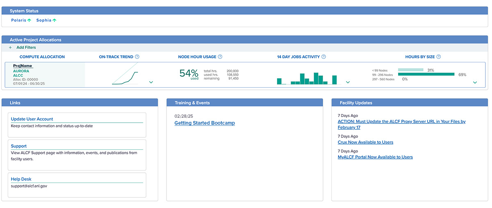
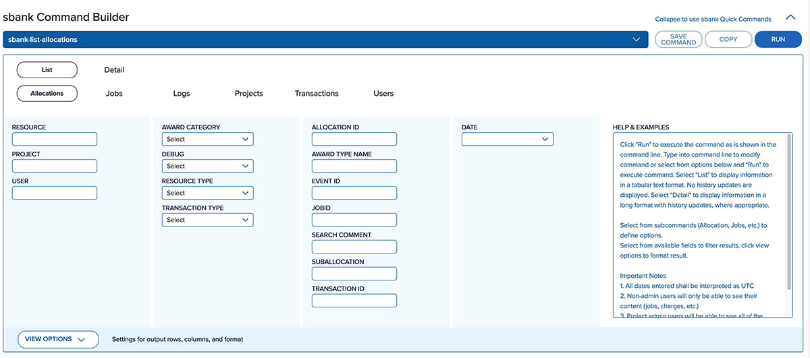
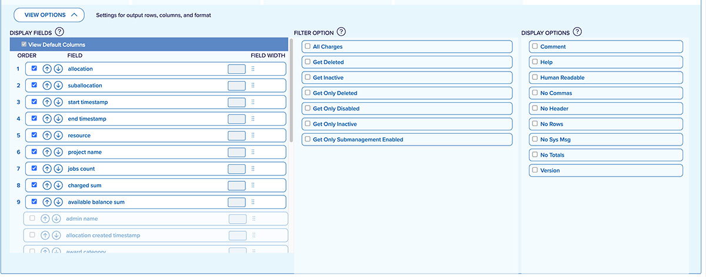

# Getting Started on MyALCF

## Access MyALCF
To find MyALCF, either use the myALCF link at the [ALCF homepage](https://alcf.anl.gov) or visit the [MyALCF homepage](https://my.alcf.anl.gov)

## Logging In
Log in using your ALCF username and CRYPTOcard passcode. For those who already have an ALCF account, this set of credentials isn’t changed. For those who do not have an ALCF account, you will need to request a new account in the section below the login. For more about accounts and passcodes, see [Passcode Tokens](./alcf-passcode-tokens/)

## Home Screen Dashboard

Once logged in to MyALCF, a home screen is presented with useful information pertaining to an individual's projects and the facility. The navigation menu links to get to more in depth tools and information. Simple icons show the current status of ALCF systems. Up-to-date data about current compute project allocations are shown as a high-level view of current activity (if there are no current allocations, there will be a link to request a new allocation.) Links for support help, training event information, and facility news updates fill out the dashboard.
 *Example screenshot of dashboard.*

#### Navigation
Navigation menu items link to pages to update account and project information, use the sbank accounting tool, view training and documentation, and use any other tools your role allows you to access.  
#### System Status 
ALCF machine status is visible with a green up arrow showing a running system and a red down arrow showing a system down for scheduled or unscheduled maintenance. Clicking the system name will take you to the resource status page for that machine if available. Machine usage, active jobs, and more is shown on the [resource status page](https://status.alcf.anl.gov/#/home). 
#### Current Allocations  
Collection of data showing status and usage of compute allocations. If there are no current compute allocations, a link to request a new discretionary allocation is visible. Data for each allocation is presented in rows with five columns per row. 
- Compute Allocation - The project name, system, award type, allocation ID and dates. 
- On-track Trend - Comparison of project activity to a linear usage of hours. Expanding the graph shows a more detailed version of the graph with node hour percentage used and months specified. A second graph shows job sizes needed to use all node hours available in the remaining time.
 *Screenshot of example expanded on-track graph.*
- Node Hour Usage - Total node hours available, used, and remaining in the allocation.
- 14 Day Jobs Activity show a simple graph of the last two weeks of actvity. Expanding it gives a more detailed view with node hour counts per day and per month.
 *Screenshot of example expanded activity graph.*
- Hours by Size - How the jobs in the allocation are split in terms of machine nodes used. Expanding this graph will give a visualization of how that split has occured over time.
 *Screenshot of example expanded jobs by size graph.*

#### Links, Training, Facility Updates 
The bottom portion of the MyALCF home screen shows quick links to training events, support, and current facility news.

## Navigation Menu
The navigation menu is personalized and shows sections available based on the user role. As more MyALCF features are developed, this menu will update to keep the site easy to navigate. All active account users will be able to access the following:  

#### Update Account
View account details and update necessary fields here. View project memberships and UNIX groups.

#### Projects & Resources
View and update project memberships, join projects, view and edit UNIX groups and request an allocation from this section.

#### sbank
sbank is the compute node hour accounting system at ALCF. It has historically been accessed via the command line but this interface allows for accessing information via graphic-based interactions. The basic capabilities and tools within the graphic interface are the following:
- Command Builder -
The Command Builder is a point-and-click style interface that allows for typing commands into the top command bar and/or selecting options from input boxes and/or dropdowns to create specific sbank commands. The default command is ‘sbank-list-allocations’. You can switch to sbank-list-jobs, sbank-detail-allocations, etc. under the top command bar and refine the command below via the input fields. Dynamic help is offered when a field is highlighted to explain the command and give examples. The output commands can be altered in the ‘view options’ panel accessed via the "View Options" button.
 *Screenshot of command builder portion of sbank page.*

- View Options -
View Options is shown as a set of three lists with selectable items that affect how the output is presented.
  * Display Fields -
The column titles that will show in the output. The column titles are listed in the order they will be viewed in the output (1 is the column shown to the left extent, followed to the right by 2, 3, etc.) The column titles are selectable/deselectable and can be reordered via the arrow buttons or by dragging and dropping them to the desired order. "Field Width" is available if a character limit is desired in the column's output.
  * Filters -
Allows for toggling between different sets of rows available. By default, output is for active allocations.
  * Display Options -
Allows for toggling items shown in the output.

 *Screenshot of the view options portion of sbank page.*

- Output -
The output can be either text based or an html table that is filterable. This is done by toggling between ‘text output’ and ‘html output’ next to the output window. Output can be saved as .csv by clicking the ‘Save Output’ button next to the output window.
Commands can also be saved by clicking the ‘save command’ button. 
- Popular Commands - 
Popular commands are a set of preconfigured commands that will output useful information with no modification necessary.  ‘Popular Commands’ can be accessed by clicking the ‘Quick Commands’ bar. Each command can be run as is or can be copied to the clipboard for use in the command line or copied to the command builder.
- Saved Commands -
Commands that are likely to be repeated can be saved for later use with the ‘save command’ feature. ‘Save command’ buttons can be found next to the command bar or next to the output window. When you want to save a command, enter it via the command bar or by selecting options through the interface, click the save command button, and then enter a name and a brief description of the function. Once saved, the command will be accessible in the saved commands window unless deleted. The saved command can be run as is, copied to either the command builder or clipboard, edited (name and description), or deleted. 

#### Training 
Link to ALCF training events.

#### User Guides
Link to ALCF User Guides.

