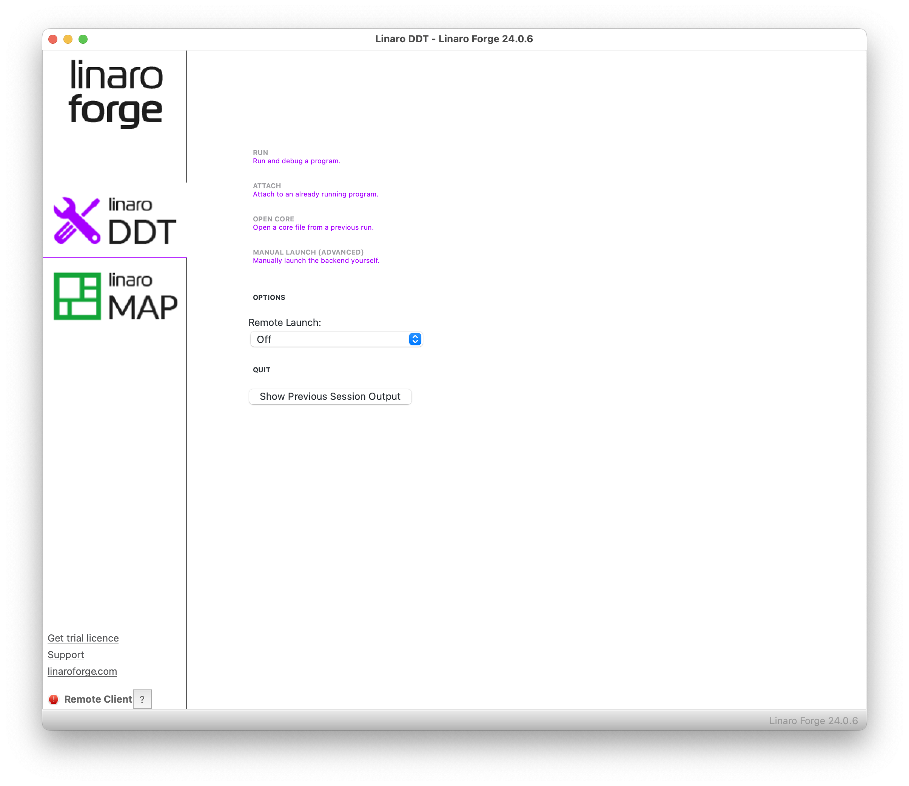
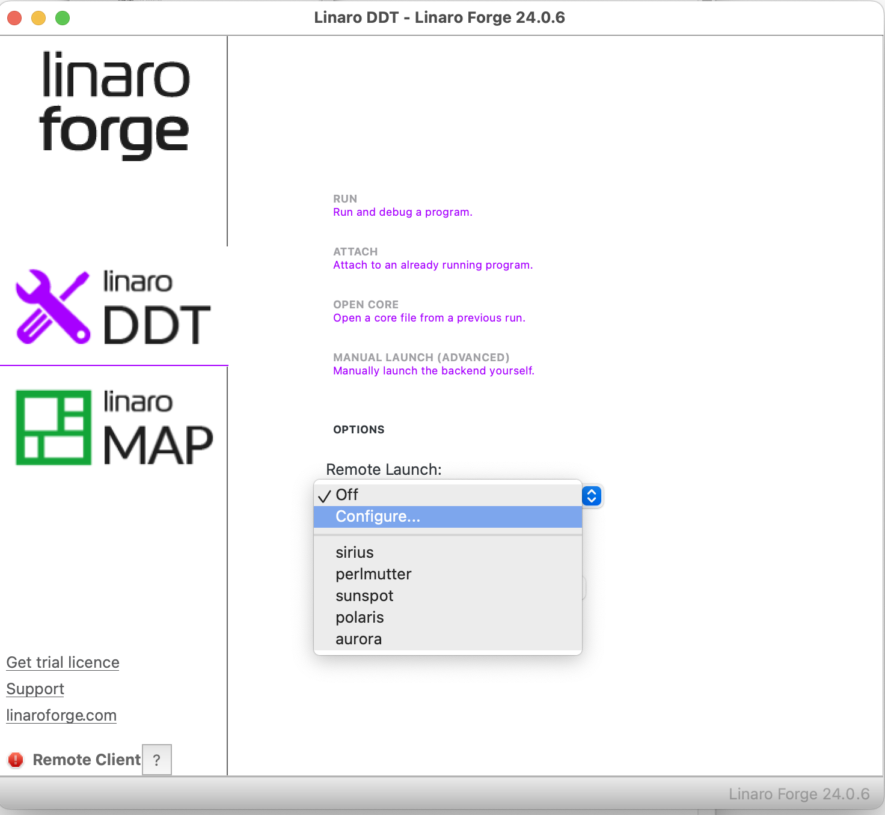
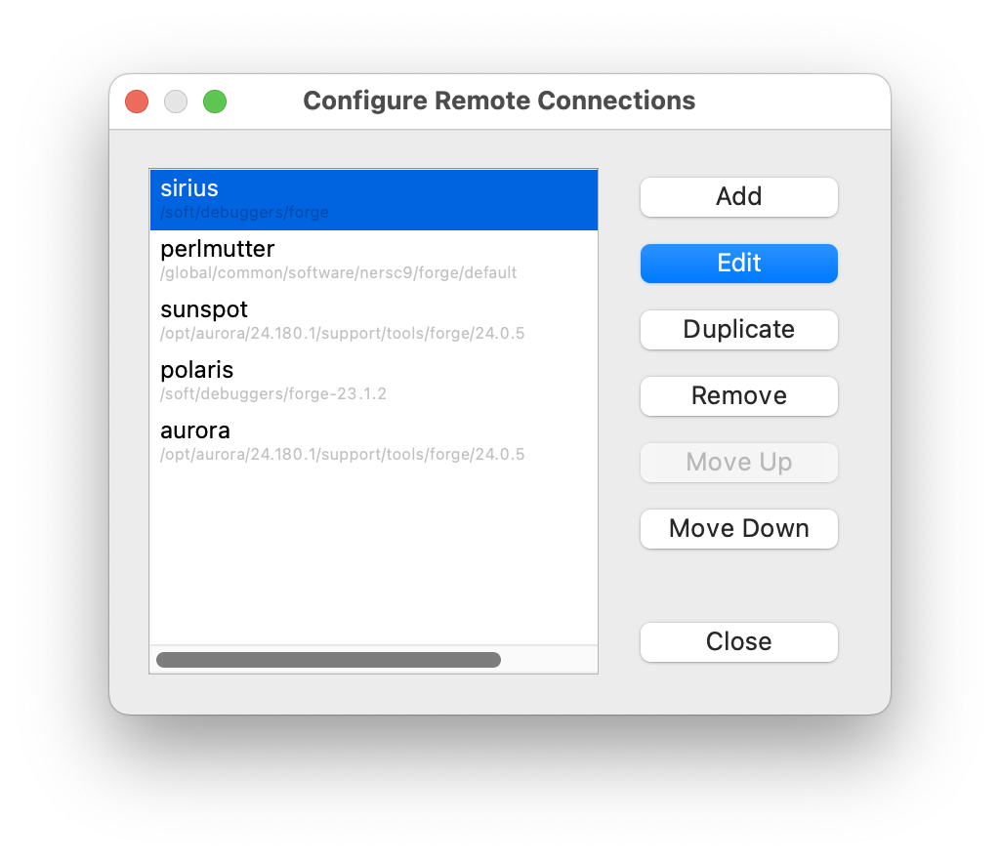
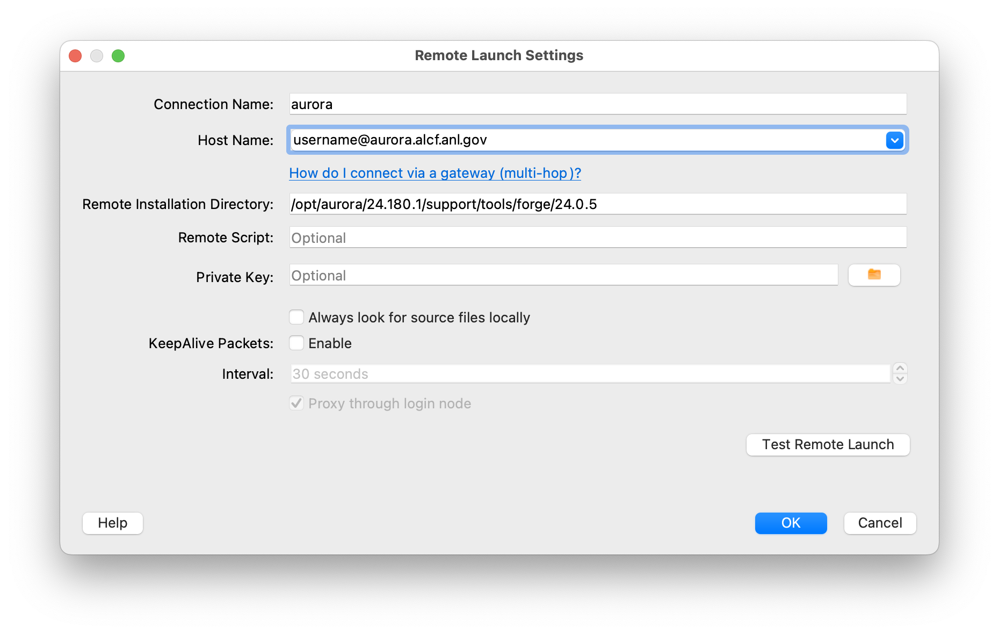
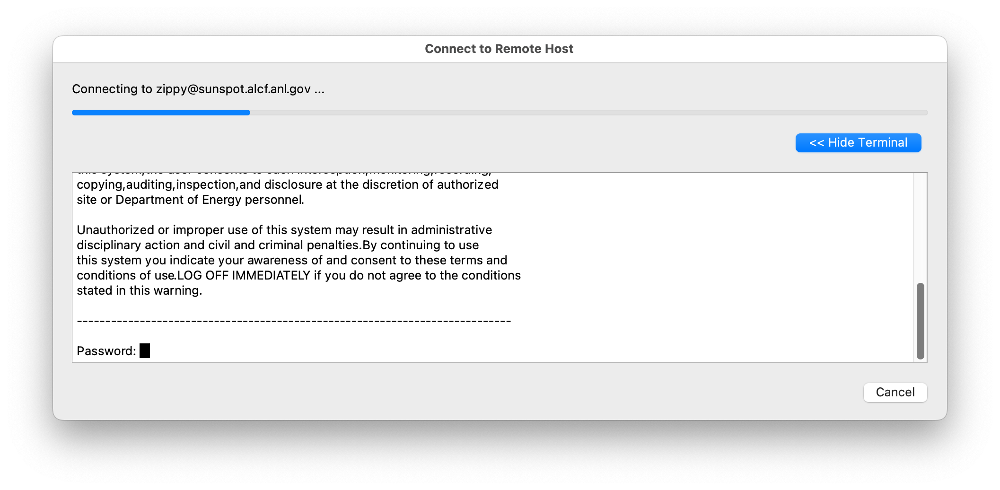
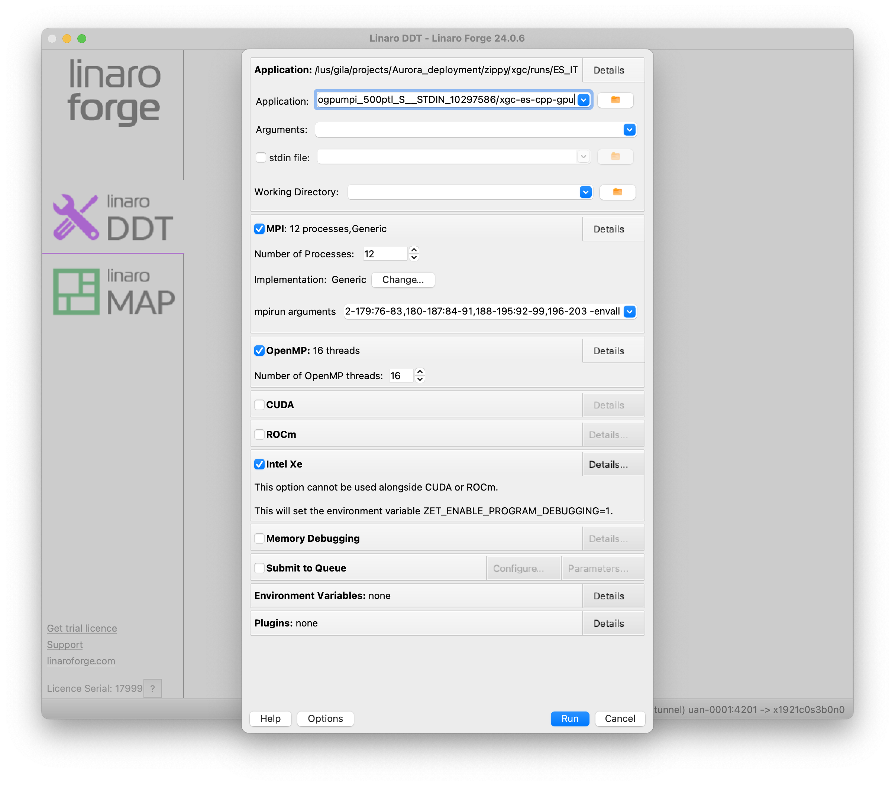
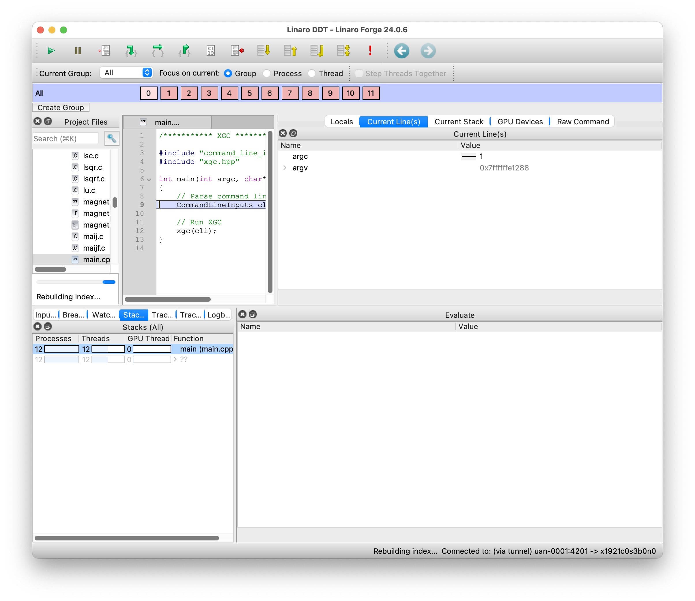

# Debugging on Aurora with DDT

We have licenses for Linaro DDT on Aurora, a parallel debugger that is able to use [gdb-oneapi](./gdb-oneapi.md) as its underlying engine on Aurora. This is not a tutorial on DDT; for that you should use Linaro's documentation, such as the documentation bundled with their client programs. Here we provide specific information on using DDT interactively in the GUI client-server mode on Aurora.

## Client

Download and install the latest Linaro Forge client for your desktop/laptop system from the [Linaro website](https://www.linaroforge.com/download-documentation/). This is available for linux, MacOS, and Windows systems.

### Configuring the Remote Client

Before you can start a DDT debugging session on Aurora compute nodes, you must set your client for remote connection from Aurora compute nodes. Your client window should look something like this:



Click the Remote Launch pull-down and click Configure to create a connector for Aurora:



Click the Add button on the Configure Remote Connections screen:



Create a configuration named "aurora," and set it up like this example, replacing "username" with your actual ALCF login name:



You may want to test the configuration. To do that, click the Test Remote Launch button. If you see a login prompt like the following example, use your usual ALCF one-time password:



If the test is successful, you are are ready to proceed from an Aurora compute node.

### Invoking the DDT Server from Aurora

To run DDT interactively from Aurora, start up an [interactive PBS job](../running-jobs-aurora.md#interactive-jobs-on-compute-nodes). You'll need to load a module to access DDT:

```
module load forge
```

If you are using a wrapper script to map MPI ranks to PVC GPU tiles, you must set this environment variable to the full path to that wrapper script:

```
export FORGE_DEBUGGER_WRAPPER=/opt/aurora/24.180.1/support/tools/mpi_wrapper_utils/gpu_tile_compact.sh
```

As discussed with respect to [gdb-oneapi](./gdb-oneapi.md), you must explicitly enable GPU debugging on all the PVC GPUs you are using, on all the nodes you are using. One way to do this is to create a script and execute it across all your compute nodes using `mpiexec`. Here is an example script, which takes an argument `1` to enable debugging or `0` to disable it:

```bash linenums="1" title="helper_toggle_eu_debug.sh"
#!/usr/bin/env bash
# helper_toggle_eu_debug.sh

export MY_RANK=${PMIX_RANK}
export MY_NODE=${PALS_NODEID}
export MY_LOCAL_RANK=${PALS_LOCAL_RANKID}

eu_debug_toggle() {
  for f in /sys/class/drm/card*/prelim_enable_eu_debug
  do
    echo $1 > $f
  done
  echo "INFO: EU debug state on rank-${MY_RANK}: $(cat /sys/class/drm/card*/prelim_enable_eu_debug | tr '\n' ' ')"
  # sleep 10
}

# One rank per node toggles eu debug:
if [ ${MY_LOCAL_RANK} -eq 0 ]; then
    eu_debug_toggle $1
    touch eu_debugs/eu_debug_toggled0_${MY_NODE}.flag
fi
```

From the interactive prompt on your lead Aurora compute node, issue

```
export NNODES=`wc -l < $PBS_NODEFILE`
mpiexec -n $NNODES ./helper_toggle_eu_debug.sh 1
```

To start the DDT server and connect to your client, make sure your client is running and you have selected the remote connection to aurora you created as shown above. On the Aurora compute node shell prompt, issue the command to debug your binary like this example:

```
ddt --connect --mpi=generic --mpiargs="-l --np 12 -ppn 12 --cpu-bind verbose,list:0-7,104-111:8-15,112-119:16-23,120-127:24-31,128-135:32-39,136-143:40-47,144-151:52-59,156-163:60-67,164-171:68-75,172-179:76-83,180-187:84-91,188-195:92-99,196-203 -envall" ./a.out
```

On the client, you should see a connection pop-up like this:


Click the Connect button. This should bring up a DETAILS pane that looks like the following example. Make sure the Implementation is set to "Generic" (change it to Generic if it isn't). Likewise confirm and adjust the number of OpenMP threads and other parameters to be correct for your run. For PVC debugging, the Intel Xe box should be checked:



When you are satisfied with the details, click the Run button. This should pop up a window that shows the multiple processes starting up. If that startup completes normally, the pop-up will disappear and your client window should reveal the full DDT debugging GUI interface, something like this example:



From here, you should be able to control starting and stopping processes, ranks, and threads (CPU and GPU threads). If you set a breakpoint or otherwise stop in the source code for a GPU-offloaded kernel, you should be able to click the Thread radio button and see threads with a "GPU" badge on them. As mentioned above, this is not meant to be full documentation on how to use DDT. A good place to start with that is to open the User Guide from the Help menu in the client application.
