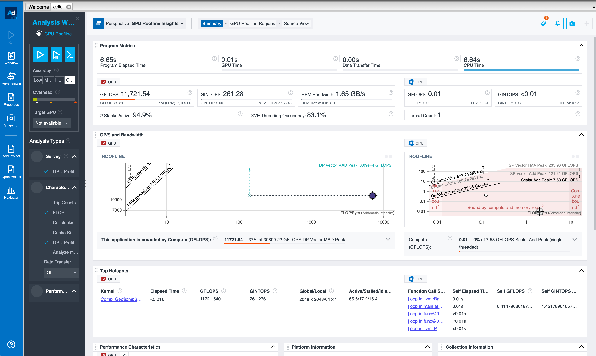
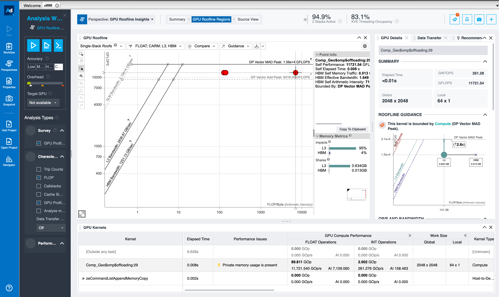

# Advisor

## Introduction

Intel® Advisor is a design and analysis tool for developing performant code. The tool supports C, C++, Fortran, SYCL, OpenMP, OpenCL™ code, and Python. It helps with the following:

* Performant CPU Code: Design your application for efficient threading, vectorization, and memory use.
* Efficient GPU Offload: Identify parts of the code that can be profitably offloaded. Optimize the code for compute and memory.
* Flow Graph Design and Analysis: Create, visualize, and analyze task and dependency computation for heterogeneous algorithms. 

### Roofline and Performance Insights for GPUs

Get actionable advice for performant GPU code. In addition to the Roofline Analysis for kernels, you can:

* Get specific, actionable recommendations to design code that runs optimally on GPUs.
* See the CPU and GPU code performance side-by-side with a unified dashboard.
* Discover GPU application performance characterization, such as bandwidth sensitivity, instruction mix, and cache-line use.

### Offload Modeling

Understand if your code benefits from GPU porting or how much performance acceleration your GPU code can get from moving to a next-generation GPU. You can:

* Pinpoint offload opportunities where it pays off the most.
* Project the performance on a GPU.
* Identify bottlenecks and potential performance gains.
* Get guidance for optimizing data transfer between host and target devices.

## A quick instruction for Advisor roofline analysis on Intel GPUs

Step 1: Setting the environments

```bash
$ module load oneapi
$ export PRJ=<your_project_dir>
```

Step 2-a: Collecting the GPU Roofline data on a single GPU (Survey analysis and Trip Count with FLOP analysis)

```bash
$ advisor --collect=roofline --profile-gpu --project-dir=$PRJ -- <your_executable> <your_arguments>
```

Step 2-b: Collecting the GPU Roofline data on one of MPI ranks (Survey analysis and Trip Count with FLOP analysis)

```bash
$ mpirun -n 1 gpu_tile_compact.sh advisor --collect=survey --profile-gpu --project-dir=$PRJ -- <your_executable> <your_arguments> : -n 1 gpu_tile_compact.sh <your_executable> <your_arguments>
$ mpirun -n 1 gpu_tile_compact.sh advisor --collect=tripcounts --profile-gpu --flop --no-trip-counts --project-dir=$PRJ -- <your_executable> <your_arguments> : -n 1 gpu_tile_compact.sh <your_executable> <your_arguments>
```

Step 3-a: Generate a GPU Roofline report, and then review the HTML report

```bash
$ advisor --report=all --project-dir=$PRJ --report-output=${PRJ}/roofline_all.html
```

Step 3-b: Download the project folder to your local system and open it with [the stand-alone Advisor Client](https://www.intel.com/content/www/us/en/developer/articles/tool/oneapi-standalone-components.html#advisor)

## Simple examples

### Advisor roofline analysis for one MPI rank out of 12 MPI ranks

```bash
$ mpiexec -n 1 gpu_tile_compact.sh advisor --collect=survey --profile-gpu --project-dir=Advisor_results -- ./Comp_GeoSeries_omp_mpicxx_DP 2048 1000 : -n 11 gpu_tile_compact.sh ./Comp_GeoSeries_omp_mpicxx_DP 2048 1000
$ mpiexec -n 1 gpu_tile_compact.sh advisor --collect=tripcounts --profile-gpu --flop --no-trip-counts --project-dir=Advisor_results -- ./Comp_GeoSeries_omp_mpicxx_DP 2048 1000 : -n 11 gpu_tile_compact.sh ./Comp_GeoSeries_omp_mpicxx_DP 2048 1000
$ advisor --report=all --project-dir=Advisor_results --report-output=Advisor_results/roofline_all.html
```






## References  
[Intel Advisor User Guide](https://www.intel.com/content/www/us/en/docs/advisor/user-guide/current/overview.html)

[Intel Advisor Performance Optimization Cookbook](https://www.intel.com/content/www/us/en/docs/advisor/cookbook/current/overview.html)


