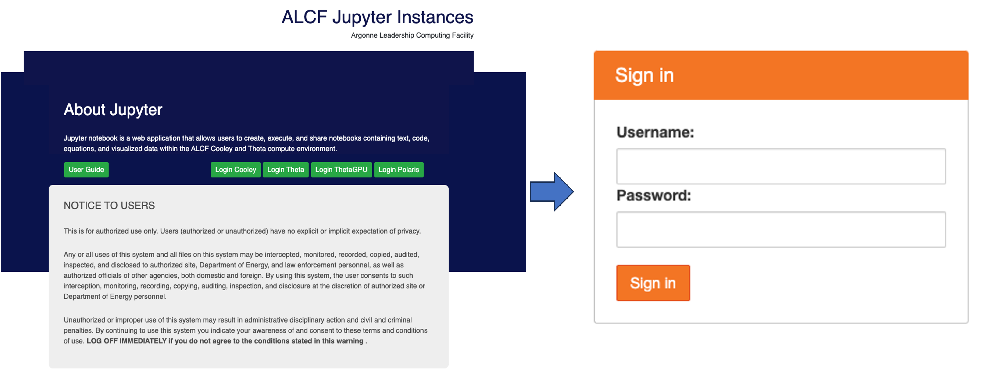
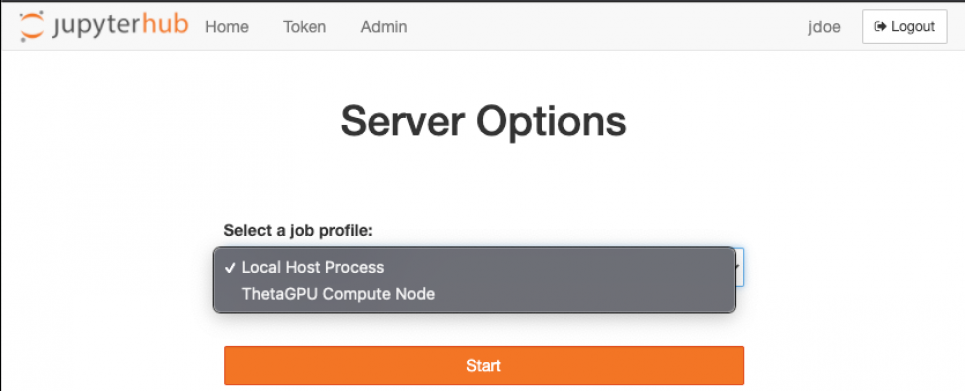

# JupyterHub

JupyterHub is an open-source service application that enables users to launch
separate Jupyter instances on a remote server. [ALCF
JupyterHub](https://jupyter.alcf.anl.gov) provides access to Polaris, ThetaGPU,
Theta, and Cooley with the same [authentication
protocol](../account-project-management/accounts-and-access/alcf-passcode-tokens.md)
that is used to access these systems, but through a web interface rather than a
terminal. On the [ALCF JupyterHub](https://jupyter.alcf.anl.gov) home page users
can select the system they want to use and after making their choice, they will
see the sign in page, where they need to enter their ALCF username and [passcode
token](../account-project-management/accounts-and-access/alcf-passcode-tokens.md).

<figure markdown>
  { width="700" }
  <figcaption>ALCF JupyterHub home page and sign in screen</figcaption>
</figure>

We describe below how to use JupyterHub on Polaris, ThetaGPU, Theta, and Cooley
in more detail.

## Polaris

The Polaris JupyterHub instance runs on Polaris compute nodes through the job
scheduler. After the authentication step, the user will be presented with the
menu of the available job options to start the Jupyter instance.

- Select a job profile:  This field lists the available profiles, which is
  limited to “Polaris Compute Node” at this time.
- Queue Name: This field provide a list of available queues on the system.
- Project List: This field displays the active projects associated with the user
  on Polaris.
- Number of Nodes: This field allows the user to select the number of compute
  nodes to be allocated.
- Runtime (minutes:seconds) : This field allows the user to set the runtime of
  the job in minutes and seconds. The user should refer to the [Polaris queue
  scheduling
  policy](../theta-gpu/queueing-and-running-jobs/job-and-queue-scheduling.md)
  for minimum and maximum runtime allowed for the selected queue.
- File Systems: This field allows the user to select the file systems to be
  mounted. By default all the file systems are selected.

<figure markdown>
  { width="700" }
  <figcaption>Polaris Job options</figcaption>
</figure>

Once the appropriate information is provided the user will click the “Start”
button and wait for the job to spawn. If there's an extended wait time due to a
lengthy job queue, the interface might time out, leading to the job's removal
from the queue. If not, the job kicks off and it begins to use up the user's
allocation based on the chosen job options. It's crucial for users to shut down
the server when resources are no longer required. Failing to do so will result
in continued consumption of the allocated time until the predetermined runtime
concludes. 

## ThetaGPU

The ThetaGPU JupyterHub instance can run either on an external server or
directly on ThetaGPU compute nodes. After the authentication step, the user will
be presented with a drop down menu to "Select a job profile", with the options
“Local Host Process” and “ThetaGPU Compute Node” as shown below.

<figure markdown>
  { width="700" }
  <figcaption>Select a job profile</figcaption>
</figure>

"Local Host Process” will start the Jupyter Notebook on the JupyterHub server
(external to the compute resource).

"ThetaGPU Compute Node" will allow a user to start a Jupyter Notebook instance
on an available compute node by requesting a node via the job scheduler, Cobalt.
When a user selects this option additional options will appear as shown below.

- ThetaGPU Queue (MinTime/MaxTime): This field provide a list of available
  queues on the system with the minimum and maximum times allowed for each
  queue.
- Project List:  This field displays the active projects associated with the
  user on the given system (ThetaGPU).
- Runtime (minutes):  This field allows the user to set the runtime of the job
  in minutes. Please note that minimum and maximum times are shown on the menu.
  You may refer to the [ThetaGPU queue scheduling
  policy](../theta-gpu/queueing-and-running-jobs/job-and-queue-scheduling.md)
  for more details.

<figure markdown>
  { width="700" }
  <figcaption>ThetaGPU Job options</figcaption>
</figure>

Once the appropriate information is provided the user will click the “Start”
button and wait for the job to spawn. In cases where the job queue is long the
interface will time out and the job will be removed from the queue.

<figure markdown>
  { width="700" }
  <figcaption>Job queued</figcaption>
</figure>

> **_NOTE:_** If you would like to change your selection about where to run the
> Jupyter Notebook, after the Notebook started, you need to stop the server to
> be able to see the drop down menu again.

## Theta and Cooley
JupyterHub for Cooley and Theta deploy notebooks on an external server that
mounts the same home directory
([swift-home](../data-management/filesystem-and-storage/file-systems.md)) as
used in these systems. However, users cannot directly access the compute nodes
for these systems. We would like to note that both Cooley and Theta will be
retired by the end of 2023, therefore we recommend our users to switch to
Polaris and ThetaGPU instead.


## Additional Notes
### Ending a Jupyter Notebook running on a compute node ###
Failing to correctly end a running Jupyter Notebook will continue to consume the
selected project's allocation on the resource in question. When a user has
completed their task in Jupyter the user should stop the Jupyter instance
running on the compute node before logging out.  To stop the Notebook, click the
“Control Panel” button in the top right, then click “Stop My Server”.

<figure markdown>
  { width="700" }
  <figcaption>Stop panel</figcaption>
</figure>

<figure markdown>
  { width="700" }
  <figcaption>Stop server</figcaption>
</figure>

 
### Customizing Environment

ALCF provides a simple Python environment to start.  User can customize their
environment to meet their needs by creating a virtual Python environment and a
new ipython kernel.  Below is an example of setting up a simple environment
`tf_env` with TensorFlow.

For more information on how to manage conda environments, refer to this
[page](https://conda.io/docs/user-guide/tasks/manage-environments.html).

From a terminal:
```
# Load a conda module
module load conda
conda activate base

# set shell proxy variables to access external URL
export http_proxy=http://proxy.alcf.anl.gov:3128
export https_proxy=$http_proxy

# create an environment name tf_env
conda create -y -n tf_env

# Activate conda environment
conda activate tf_env

# Install required packages
conda install -y jupyter nb_conda ipykernel tensorflow

# Add environment to available kernel list
python -m ipykernel install --user --name tf_env

# deactivate conda environment
conda deactivate
```

Once the base environment is set up the user must add an `env` section to the
`kernel.json` file, located in directory
`${USER}/.local/share/jupyter/kernels/tf_env`, defining the `CONDA_PREFIX` and
`PATH` variables.  Currently, Polaris compute nodes access the internet through
a proxy.  To configure the kernel to use the proxy add variables `http_proxy`
and `https_proxy` to the `env` section.  This will allow users to install
packages within the notebook using `!conda` magic commands.  The following is a
sample configuration:

```
{
 "argv": [
  "/home/<user>/.conda/envs/tf_env/bin/python",
  "-m",
  "ipykernel_launcher",
  "-f",
  "{connection_file}"
 ],
 "display_name": "tf_env",
 "language": "python",
 "env": {
    "CONDA_PREFIX":"/home/<user>/.conda/envs/tf_env",
    "PATH":"/home/<user>/.conda/envs/tf_env/bin:${PATH}",
    "http_proxy":"http://proxy.alcf.anl.gov:3128",
    "https_proxy":"http://proxy.alcf.anl.gov:3128"
 },
 "metadata": {
  "debugger": true
 }
}
```

After completing these steps, you will see `tf_env` kernel when you click new on
the JupyterHub home page or when you use kernel menu on the Jupyter notebook.

### Accessing Project Folders

Jupyter file browser limits the user to view files and directories within their
home directory. To access directories located outside of the user home directory
a symbolic link to the directory must be created within the user home directory.
An example of this is:

```bash
ln -s /project/ABC ~/ABC_project_link
```
Please note that one can run any shell command directly on a Jupyter notebook by
simply adding an exclamation mark, `!`, to the beginning of the command. For example,
the above command can be run from a notebook cell as follows:

```bash
!ln -s /project/ABC ~/ABC_project_link
```
